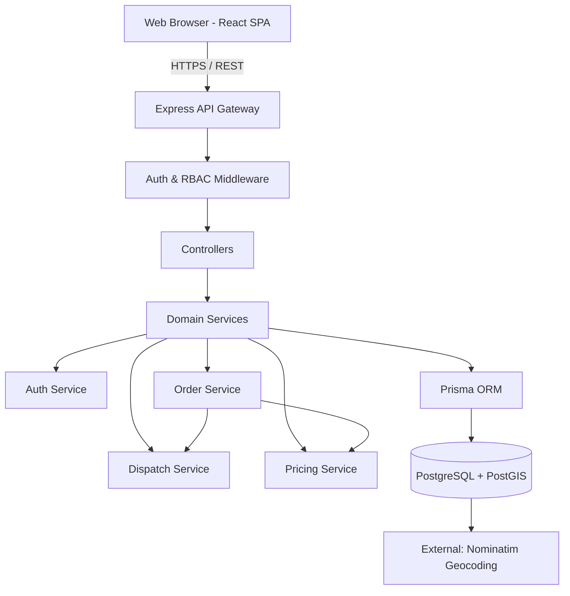
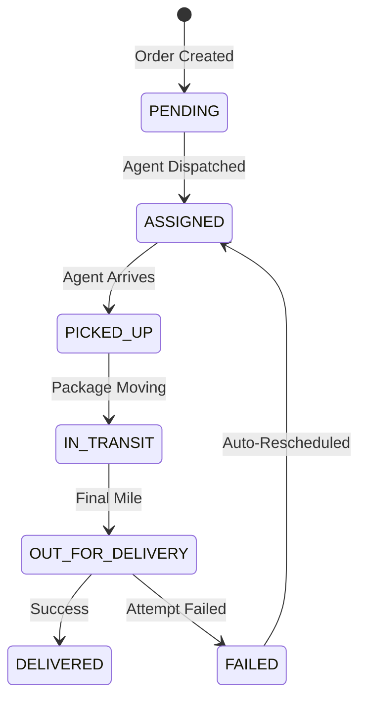

# Last Mile Delivery Tracker

An intelligent last-mile logistics platform for order management, dynamic pricing, spatial dispatch, delivery tracking, and fleet operations.

## Overview

The Last Mile Delivery Tracker is designed to solve complex operational challenges in modern logistics. Rather than just tracking a package, this system coordinates dynamic B2B and B2C pricing rules, geographically-aware agent assignment using PostGIS, and high-fidelity operational transparency for three distinct user roles.

- **Admin (Operations Center):** Manages the fleet, configures geographic zones and rate cards, monitors real-time dispatch, and oversees order lifecycles.
- **Customer:** Receives instant, accurate quotes based on spatial constraints (Intra/Inter-zone), creates orders, and tracks real-time progress.
- **Agent (Fleet):** Operates the delivery queue, processes delivery attempts, and updates lifecycle statuses dynamically.

## Key Capabilities

| Capability | Status | Description |
|---|---|---|
| Customer Authentication | Implemented | Secure JWT-based authentication & registration. |
| Order Management | Implemented | E2E lifecycle: Pending → Assigned → Transit → Delivered. |
| Dynamic Pricing | Implemented | B2B/B2C, volumetric vs actual weight, zone relationship mapping. |
| COD Surcharges | Implemented | Automated Cash on Delivery surcharge application. |
| Intelligent Dispatch | Implemented | Automated distance-based agent candidate scoring. |
| Geospatial DB Integration | Implemented | Powered by PostgreSQL/PostGIS (`ST_Distance`, `ST_MakePoint`). |
| Delivery Tracking | Implemented | Immutable event-driven historical ledger for each order. |
| Fleet Management | Implemented | Fleet tracking, zone assignment, availability toggling. |
| Customer Feedback | Implemented | Delivery performance ratings and reviews. |
| Agent Performance | Implemented | Fleet KPI tracking based on delivery success and feedback. |
| Explainable Dispatch | Implemented | Real-time breakdown of why an agent was/wasn't selected. |

## Value-Added Features Beyond Core Requirements

Beyond the core functional requirements, the platform implements several additional capabilities to improve operational usefulness, user experience, security, and real-world logistics applicability.

| Value-Added Feature | What We Implemented | Practical Value |
|---|---|---|
| OTP/Email Verification | Account verification workflow for new registrations | Improves account authenticity and security |
| Geospatial Support | Native PostgreSQL/PostGIS geography coordinates | Enables high-precision location-aware operations |
| Agent Location Management | Database storage and display of geographic agent coordinates | Improves operational visibility for dispatchers |
| Customer Feedback | Post-delivery customer ratings and feedback system | Enables ongoing service-quality evaluation |
| Intelligent/Explainable Dispatch | Distance-based calculation scoring with logged rejection criteria | Provides transparent dispatch decision-making |
| Dynamic Pricing Engine | Snapshot-based engine with Volumetric weight and B2B/B2C logic | Provides accurate, immutable pricing transparency |
| Role-Based Dashboards | Distinct frontend workflows for Admin, Agent, and Customer | Ensures users only receive relevant operational context |
| Tracking History | Immutable append-only ledger of status changes and actors | Enables operational traceability for delays or disputes |
| Delivery Attempts / Failure Handling | Dedicated delivery attempt tracking and failure/retry states | Improves visibility into unsuccessful final-mile execution |
| Operational Notifications | Event-driven status triggers for email notifications via Resend | Keeps customers informed automatically |

## Why This Architecture

This platform leverages specific tools to solve core domain problems:

- **PostGIS (`ST_Distance`):** Real-world dispatch requires knowing spatial proximity. Rather than pulling all agents into Node.js to calculate distance, PostGIS computes spatial proximity natively at the database layer, filtering candidates before they hit the application layer.
- **Prisma Transactions:** Delivery assignments and status overrides require strict concurrency protection to prevent double-dispatching an agent.
- **PricingSnapshot Pattern:** The pricing engine enforces immutability. An order placed today must retain today's rate configuration, even if rate cards change tomorrow. PricingSnapshots permanently record the mathematical breakdown at the time of creation.
- **Zod + TypeScript:** Enforces rigorous contract boundaries, preventing invalid payload states (like negative weights or unknown coordinates) from reaching the database.
- **Test Database Isolation:** Using a dedicated `DATABASE_URL_TEST` ensures that the integration tests (which aggressively wipe and seed states) never corrupt the development or staging databases.

## System Architecture



### Production Deployment Architecture

Browser
↓
Vercel frontend
↓
Render backend API
↓
Supabase PostgreSQL/PostGIS

Supporting services:
- Resend
- Nominatim


## User Roles & RBAC

The system employs strict backend Route Protection & RBAC checking, ensuring roles cannot cross trust boundaries.

| Capability | Admin | Customer | Agent |
|---|:---:|:---:|:---:|
| System Configuration (Rates/Zones) | ✓ | - | - |
| Fleet & Agent Management | ✓ | - | - |
| Force Dispatch / Reassign | ✓ | - | - |
| View System Logs / Explanation | ✓ | - | - |
| Create Orders | ✓ | ✓ | - |
| Track Owned Orders | - | ✓ | - |
| Submit Feedback | - | ✓ | - |
| Update Order Status | - | - | ✓ |
| Toggle Availability | - | - | ✓ |

## Order Lifecycle

The system utilizes a strictly defined state machine for order lifecycles.



- **Transitions:** Transitions are strictly validated (e.g. an Agent cannot transition an order from `PENDING` to `DELIVERED`).
- **Tracking Ledger:** Every state change emits a `TrackingHistory` event with the actor, timestamp, and metadata.

## Pricing Engine

The pricing engine dynamically calculates charges based on logistics rules:
1. **Volumetric vs Actual Weight:** Calculates `(L * B * H) / 5000` and charges based on whichever is higher (`billableWeight`).
2. **Zone Relationship:** Computes if the route is Intra-zone (same zone) or Inter-zone (cross zone).
3. **Customer Class:** Diverges logic for B2B vs B2C rate cards.
4. **Surcharges:** Automatically attaches fixed COD surcharges if the payment type requires it.

**PricingSnapshot:** Upon order creation, all of the variables above (including the raw calculation breakdown) are serialized into a read-only `PricingSnapshot` record, completely decoupling the historical order from future rate configurations.

## Intelligent Dispatch

The dispatch engine operates on a multi-stage funnel:

1. **Candidate Retrieval:** Queries `AgentProfile` for active agents with valid geospatial coordinates.
2. **Eligibility Filtering:** Filters out agents who are currently `isAvailable = false` or already handling an active assignment.
3. **Spatial Calculation:** Uses PostGIS `ST_Distance` to compute the direct meter distance between the Order's pickup coordinates and the Agent's last known coordinates.
4. **Ranking:** Sorts eligible agents by absolute nearest proximity.
5. **Atomic Assignment:** Locks the agent and generates a `DeliveryAttempt` record within a Prisma transaction to prevent race conditions.

## Geocoding

The system utilizes **Nominatim (OpenStreetMap)** to dynamically convert human-readable addresses or fallback inputs into high-precision Latitude/Longitude coordinates. 
These coordinates are then cast into PostGIS Geography points `Unsupported("geography(Point, 4326)")` for use in spatial distance equations.

## Tracking & Delivery History

Instead of mutating a single string, the system generates an append-only ledger (`TrackingHistory`). This provides operational transparency, allowing Customers and Admins to see exactly who performed an action (and when), ensuring accountability for failed deliveries or delays.

## Technology Stack

| Layer | Technology | Purpose |
|---|---|---|
| **Frontend** | React 19 + TypeScript | Component-based UI architecture. |
| **Styling** | Vanilla CSS Modules | Scoped, zero-dependency high-performance styling. |
| **State/Routing** | React Router + Zustand | Client-side routing and minimal global state. |
| **Backend** | Node.js + Express 5 | High-throughput REST API. |
| **Database** | PostgreSQL 16 | Relational data integrity & ACID transactions. |
| **Geospatial** | PostGIS | Native distance and geography computations. |
| **ORM** | Prisma 5.19 | Type-safe database interactions and transactions. |
| **Validation** | Zod | Runtime payload contract enforcement. |
| **Auth** | JWT | Stateless, secure role-based session management. |
| **Testing** | Jest + Supertest | Integration and E2E lifecycle testing. |

## Project Structure

```text
last-mile-delivery-tracker/
├── backend/
│   ├── prisma/             # Schema, migrations, and seed logic
│   ├── src/
│   │   ├── __tests__/      # Integration, RBAC, and dispatch tests
│   │   ├── config/         # Environment and setup
│   │   ├── controllers/    # Express route controllers
│   │   ├── middlewares/    # JWT Auth & Role guards
│   │   ├── routes/         # Express API definitions
│   │   ├── services/       # Core domain logic (Pricing, Dispatch, etc)
│   │   └── validators/     # Zod schemas
│   └── package.json
├── frontend/
│   ├── src/
│   │   ├── components/     # Shared UI primitives (Buttons, Cards, Layouts)
│   │   ├── features/       # Role-based pages (Admin, Customer, Agent)
│   │   ├── services/       # API client config
│   │   └── App.tsx         # Route registry
│   └── package.json
└── docs/                   # Extended Architecture and API documentation
```

## Local Development Setup

### Prerequisites
- Node.js (v18+)
- PostgreSQL (with PostGIS extension installed and running). Recommended to use Docker for this.

### 1. Database Setup
Ensure you have a PostgreSQL instance with PostGIS available. (If using Docker, a standard `postgis/postgis` image works perfectly).

### 2. Backend Setup
```bash
cd backend
npm install
cp .env.example .env
# Edit .env with your local PostgreSQL credentials

# Push schema to database
npx prisma db push

# (Optional) Seed the database with mock operational data
npx prisma db seed

# Start the development server
npm run dev
```

### 3. Frontend Setup
```bash
cd frontend
npm install
# Start the Vite development server
npm run dev
```

## Test Database & Architecture

The testing suite relies on a **completely isolated test database** to prevent destructive operations on your development data.
When running `npm run test` in the `backend/` directory:
1. The test runner strictly demands a `DATABASE_URL_TEST` environment variable.
2. It enforces safety guards ensuring the test DB string explicitly contains "test" to prevent catastrophic user error.
3. Tests aggressively wipe data, invoke the dispatch engine, and assert on spatial outcomes.

**Status:** The historical development and validation testing focused heavily on Admin Dispatch, Pricing constraints, and RBAC enforcement.

### Database Migration History

The database architecture followed this migration journey:
Local PostgreSQL/PostGIS → development → extensive validation → database cleanup → production migration → Supabase PostgreSQL → production validation.

Production credentials are never documented or committed to the repository.

## Production Deployment

The application is deployed and operational on modern cloud infrastructure:

Browser
↓
Vercel Frontend
↓
Render Backend API
↓
Supabase PostgreSQL
↓
Resend Email Service

### Production URLs

- **Frontend:** https://last-mile-delivery-tracker-rudran.vercel.app
- **Backend:** https://last-mile-delivery-tracker-api-c4sl.onrender.com

### Service Responsibilities

- **Vercel:** Hosts the production React/Vite frontend.
- **Render:** Hosts the Node.js/Express backend API. Handles authentication, business logic, API requests, rate limiting, and CORS.
- **Supabase:** Hosts the production PostgreSQL database (with PostGIS) and stores all application data.
- **Resend:** Handles transactional and verification email delivery.

### Production Environment Variables

Production secret values must be configured through Render and Vercel Environment Variables and must never be committed to Git.

**Render Environment Variables:**
- `DATABASE_URL`
- `JWT_SECRET`
- `FRONTEND_URL`
- `NODE_ENV`
- `RESEND_API_KEY`
- `RESEND_FROM_EMAIL`

**Vercel Environment Variables:**
- `VITE_API_URL` (Points to the deployed Render backend API)

### Production Deployment Checklist

- [x] Frontend deployed to Vercel
- [x] Backend deployed to Render
- [x] Supabase PostgreSQL configured
- [x] Production database populated with existing application data
- [x] Frontend API URL configured
- [x] Production CORS configured for the Vercel frontend
- [x] Render proxy/rate-limit configuration handled
- [x] Prisma production connection verified
- [x] Production build verified
- [x] Authentication/login tested
- [x] Existing application data verified
- [x] Resend API configured
- [ ] Dedicated email-sending domain verified in Resend
- [ ] Public registration with arbitrary external email addresses enabled after domain verification

## CI/CD

Every push to `main` and every Pull Request targeting `main` runs automated validation through GitHub Actions.

Checks include:
- Backend dependency installation (`npm ci`)
- Prisma Client generation (`npx prisma generate`)
- Backend TypeScript/build (`npx tsc -b`)
- Backend automated regression test (`npm run test`)
- Frontend dependency installation (`npm ci`)
- Frontend TypeScript validation (`npx tsc --noEmit`)
- Frontend production build (`npm run build`)

The CI pipeline uses an isolated test environment and does not modify the production Supabase database.

## Testing

### Historical Development & Validation

The system underwent extensive validation during development, with 100+ historical development/validation scenarios executed across core application workflows and edge cases before the final production database cleanup and migration. These were development/validation checks, NOT 100+ automated tests.

Functional testing covered authentication/login, API behavior, database behavior, order workflows, pricing, dispatch, agent assignment, tracking/status transitions, edge cases, and concurrency/reliability validation.

### Current Automated Regression Test

Exactly ONE representative automated regression test currently runs: `backend/src/__tests__/pricing.regression.test.ts`.

It strictly tests the deterministic business logic of the `PricingService.calculate` module (volumetric calculation, B2B/B2C logic, Zone logic, and Surcharges) from the source code.

### Production Validation

The deployed production system was manually verified after deployment. Validation included frontend deployment, backend deployment, production database connection, login/authentication, existing production data, dashboard/operational workflows, agent locations, and API communication.

#### Agent Location Issue Resolution
Following production deployment, agent latitude/longitude initially appeared as "Unknown" in the UI. Investigation showed `NULL` coordinates in the affected production records. Only the required latitude/longitude values were restored, without modifying unrelated production data. The location display was subsequently validated.


## Production Email / Account Registration Limitation

For the current deployment, email verification is configured through Resend's testing environment. Resend restricts testing emails to the account owner's email address until a sending domain is verified.

Therefore, for the current demonstration/testing deployment, new account registration should be performed using:

**`brainless1928@gmail.com`**

This is a temporary deployment limitation and not a limitation of the application's authentication architecture. The application is designed to support normal email verification once a sending domain is verified.

## Documentation References

- [Deployment Guide](docs/DEPLOYMENT.md)
- [API Documentation](docs/API.md)
- [Architecture Details](docs/ARCHITECTURE.md)
- [Requirements Compliance Matrix](docs/REQUIREMENTS.md)
- [Demo Workflow & Screenshots](docs/SCREENSHOTS.md)

## Known Limitations & Future Enhancements

### Current Production Limitations

1. Email verification currently uses Resend's testing configuration and is restricted to the Resend account email.
2. A dedicated verified sending domain has not yet been configured.
3. Public registration using arbitrary external email addresses therefore requires the future domain-verification step described below.
4. Geocoding relies on a public, rate-limited Nominatim endpoint; in a heavy production scenario, this requires a commercial API key (e.g., Google Maps/Mapbox).
5. Real-time agent location streams via WebSockets are not currently active; agent locations are updated via standard REST payloads.

### Future Production Improvements

- Verify a dedicated email-sending domain with Resend (e.g., configure DNS verification records).
- Configure production sender address (e.g., `notifications@<verified-domain>` or `noreply@<verified-domain>`).
- Enable registration for arbitrary external email addresses.
- Continue monitoring email delivery and bounce rates.
- Consider additional production observability and monitoring as usage grows.
- Integration of a dedicated Redis instance for real-time location pub/sub.
- Advanced routing optimizations (Traveling Salesperson Problem algorithms) for assigning multiple queued orders to a single agent.
