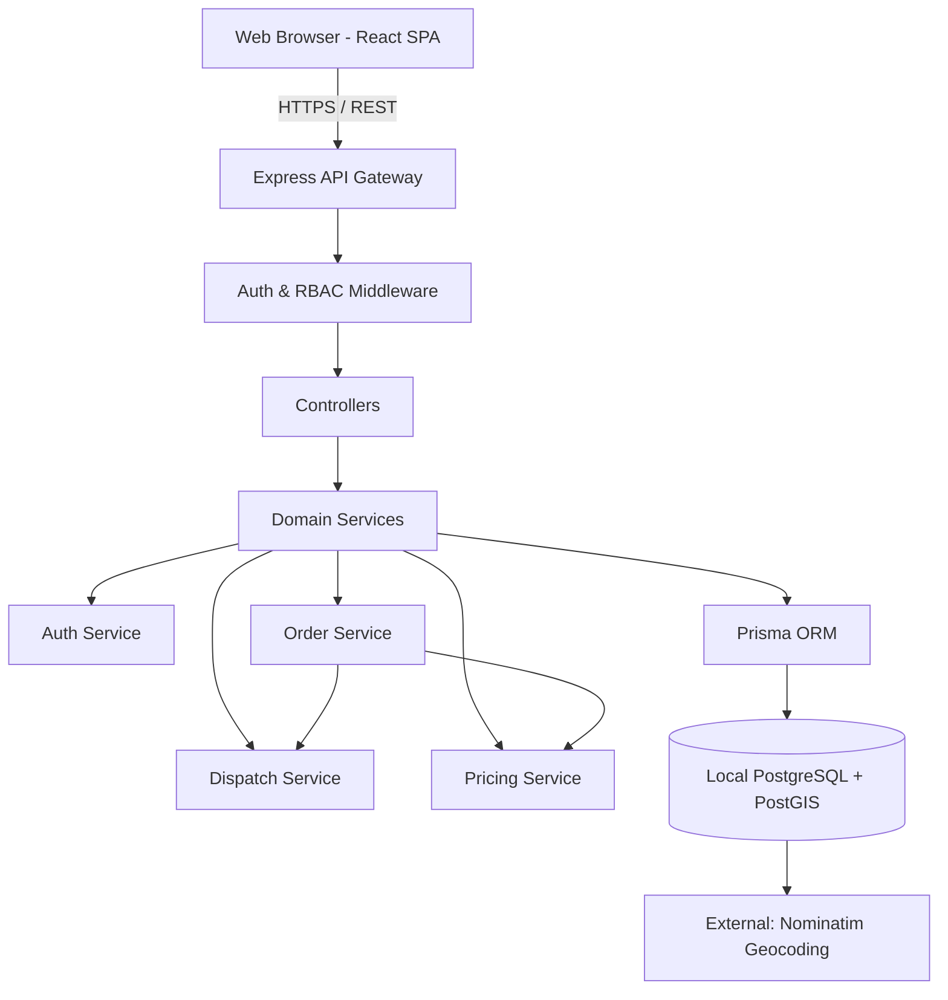
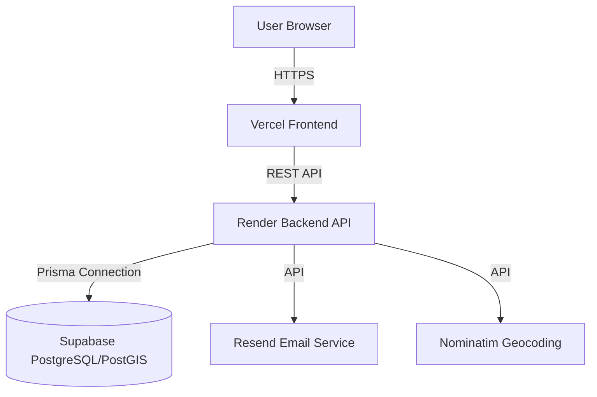
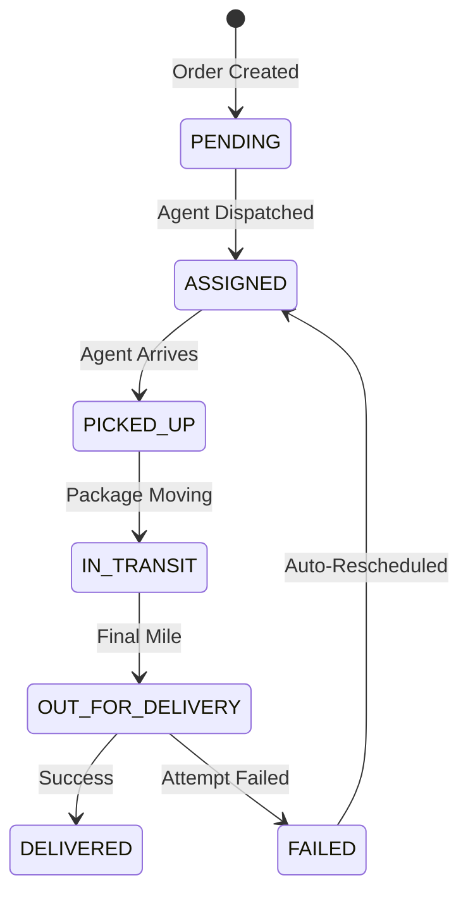
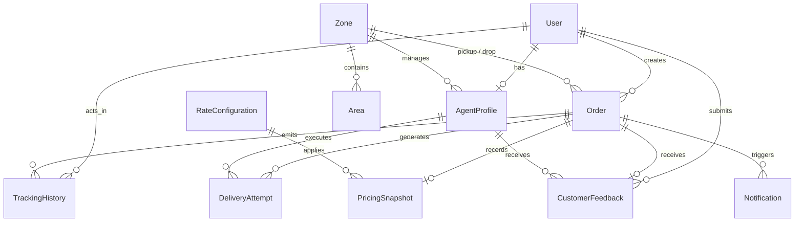
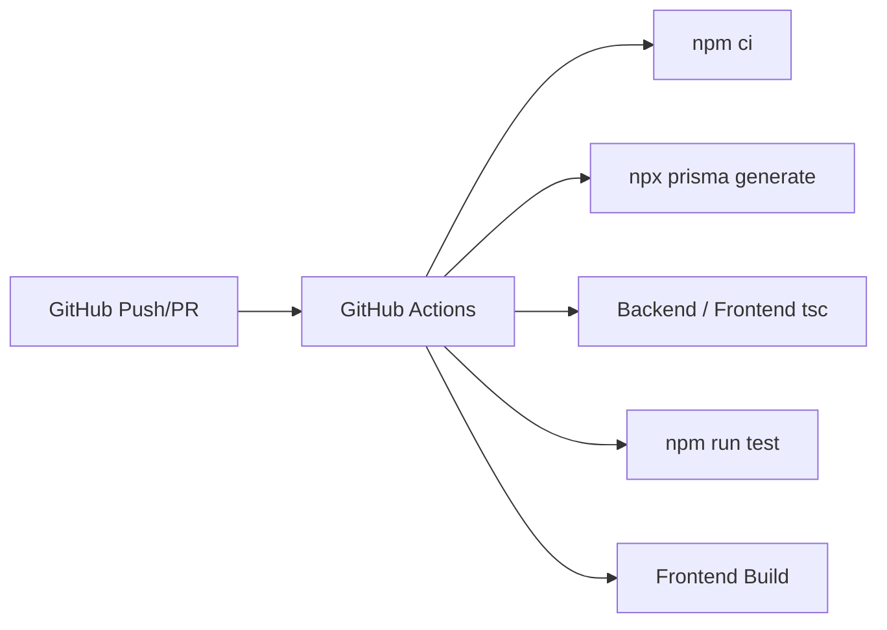
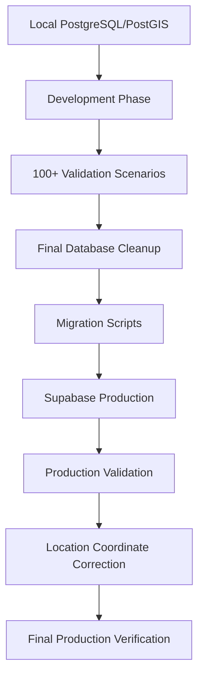

# Last Mile Delivery Tracker

[](#production-deployment)
[](#cicd-validation)
[](#database-architecture)

An intelligent last-mile logistics platform for order management, dynamic pricing, spatial dispatch, delivery tracking, and fleet operations.

## Project Overview

The Last Mile Delivery Tracker is designed to solve complex operational challenges in modern logistics. Rather than just tracking a package, this system coordinates dynamic B2B and B2C pricing rules, geographically-aware agent assignment using PostGIS, and high-fidelity operational transparency for three distinct user roles.

## Problem Statement

Modern logistics platforms struggle with dispatching the right agent, transparently calculating pricing based on volumetric constraints, and tracking precise delivery events without race conditions or database locks. Generic CRUD applications fail to solve the actual geographic and concurrency challenges of a live delivery fleet.

## Key Objectives

1. Create a mathematically robust pricing engine supporting strict logistics constraints (B2B/B2C, zones, volumetric weight).
2. Utilize native geospatial database queries to assign agents based on actual physical proximity.
3. Eliminate operational race conditions preventing an agent from receiving simultaneous overlapping dispatches.
4. Deliver high-fidelity traceability via an immutable tracking ledger.

## Core Features

| Capability | Status | Description |
|---|---|---|
| Customer Authentication | Implemented | Secure JWT-based authentication & registration. |
| Order Management | Implemented | E2E lifecycle: Pending → Assigned → Transit → Delivered. |
| Dynamic Pricing | Implemented | B2B/B2C, volumetric vs actual weight, zone relationship mapping. |
| COD Surcharges | Implemented | Automated Cash on Delivery surcharge application. |
| Intelligent Dispatch | Implemented | Automated distance-based agent candidate scoring. |
| Delivery Tracking | Implemented | Immutable event-driven historical ledger for order states. |
| Fleet Management | Implemented | Fleet tracking, zone assignment, availability toggling. |

## Value-Added Features Beyond Core Requirements

Beyond the core functional requirements, the platform implements several additional capabilities to improve operational usefulness, user experience, security, and real-world logistics applicability.

| Value-Added Feature | What We Implemented | Practical Value |
|---|---|---|
| OTP/Email Verification | Account verification workflow for new registrations | Improves account authenticity and security |
| Geospatial Support | Native PostgreSQL/PostGIS geography coordinates | Enables high-precision location-aware operations |
| Agent Location Management | Database storage and display of geographic agent coordinates | Improves operational visibility for dispatchers |
| Customer Feedback | Post-delivery customer ratings and feedback system | Enables ongoing service-quality evaluation |
| Intelligent/Explainable Dispatch | Distance-based calculation scoring with logged rejection criteria | Provides transparent dispatch decision-making |
| Dynamic Pricing Engine | Snapshot-based engine with Volumetric weight and B2B/B2C logic | Provides accurate, immutable pricing transparency |
| Role-Based Dashboards | Distinct frontend workflows for Admin, Agent, and Customer | Ensures users only receive relevant operational context |
| Tracking History | Immutable append-only ledger of status changes and actors | Enables operational traceability for delays or disputes |
| Delivery Attempts / Failure Handling | Dedicated delivery attempt tracking and failure/retry states | Improves visibility into unsuccessful final-mile execution |
| Operational Notifications | Event-driven status triggers for email notifications via Resend | Keeps customers informed automatically |

## System Architecture

### Development Architecture



### Production Architecture



## Technology Stack

| Layer | Technology | Purpose |
|---|---|---|
| **Frontend** | React 19 + TypeScript | Component-based UI architecture. |
| **Styling** | Vanilla CSS Modules | Scoped, zero-dependency high-performance styling. |
| **State/Routing** | React Router + Zustand | Client-side routing and minimal global state. |
| **Backend** | Node.js + Express 5 | High-throughput REST API. |
| **Database** | PostgreSQL 16 | Relational data integrity & ACID transactions. |
| **Geospatial** | PostGIS | Native distance and geography computations. |
| **ORM** | Prisma 5.19 | Type-safe database interactions and transactions. |
| **Validation** | Zod | Runtime payload contract enforcement. |
| **Auth** | JWT | Stateless, secure role-based session management. |
| **Testing** | Jest + Supertest | Integration and E2E lifecycle testing. |
| **CI/CD** | GitHub Actions | Automated regression and build enforcement. |

## User Roles & RBAC

The system employs strict backend Route Protection & RBAC checking, ensuring roles cannot cross trust boundaries.

| Capability | Admin | Customer | Agent |
|---|:---:|:---:|:---:|
| System Configuration (Rates/Zones) | ✓ | - | - |
| Fleet & Agent Management | ✓ | - | - |
| Force Dispatch / Reassign | ✓ | - | - |
| View System Logs / Explanation | ✓ | - | - |
| Create Orders | ✓ | ✓ | - |
| Track Owned Orders | - | ✓ | - |
| Submit Feedback | - | ✓ | - |
| Update Order Status | - | - | ✓ |
| Toggle Availability | - | - | ✓ |

## Order Lifecycle

The system utilizes a strictly defined state machine for order lifecycles.



- **Transitions:** Transitions are strictly validated (e.g. an Agent cannot transition an order from `PENDING` to `DELIVERED`).

## Intelligent Dispatch

The dispatch engine operates on a multi-stage funnel:

1. **Candidate Retrieval:** Queries `AgentProfile` for active agents with valid geospatial coordinates.
2. **Eligibility Filtering:** Filters out agents who are currently `isAvailable = false` or already handling an active assignment.
3. **Spatial Calculation:** Uses PostGIS `ST_Distance` to compute the direct meter distance between the Order's pickup coordinates and the Agent's last known coordinates.
4. **Ranking:** Sorts eligible agents by absolute nearest proximity.
5. **Atomic Assignment:** Locks the agent and generates a `DeliveryAttempt` record within a Prisma transaction to prevent race conditions.

## Pricing Engine

The pricing engine dynamically calculates charges based on logistics rules:
1. **Volumetric vs Actual Weight:** Calculates `(L * B * H) / 5000` and charges based on whichever is higher (`billableWeight`).
2. **Zone Relationship:** Computes if the route is Intra-zone (same zone) or Inter-zone (cross zone).
3. **Customer Class:** Diverges logic for B2B vs B2C rate cards.
4. **Surcharges:** Automatically attaches fixed COD surcharges if the payment type requires it.

## Geospatial & Mapping

The system utilizes **Nominatim (OpenStreetMap)** to dynamically convert human-readable addresses or fallback inputs into high-precision Latitude/Longitude coordinates. 
These coordinates are then cast into PostGIS Geography points `Unsupported("geography(Point, 4326)")` for use in spatial distance equations.

## Tracking & Delivery History

Instead of mutating a single string, the system generates an append-only ledger (`TrackingHistory`). This provides operational transparency, allowing Customers and Admins to see exactly who performed an action (and when), ensuring accountability for failed deliveries or delays.

## Customer Feedback

Once an order reaches the `DELIVERED` state, customers are prompted to provide a rating (1-5) and operational feedback for the assigned agent. This feedback is permanently tied to the `CustomerFeedback` model and contributes directly to the agent's performance metrics.

## Database Architecture

### Entity Relationships



### Database Architecture Explanation

- **PostgreSQL & PostGIS:** Chosen because logistics fundamentally requires spatial queries (`ST_Distance`). Native PostGIS geography vectors calculate real-world physical proximity significantly faster than pulling raw records into Node.js to evaluate distance mathematically.
- **Prisma ORM:** Enforces static schema types, guaranteeing geographic vectors and application relationships align without raw SQL injection vulnerabilities.
- **Order Relationships:** Orders are uniquely bound to `Zones` (for pricing routing), `Users` (for authorization scoping), and `DeliveryAttempts` (for operational history).
- **TrackingHistory Tracing:** Designed as an append-only ledger to ensure any Admin or Customer can retroactively audit an order's lifecycle without data loss.
- **DeliveryAttempts Execution:** Distinct from orders, a DeliveryAttempt tracks *who* tried to deliver the order and *when*. If a delivery fails, the order can generate a new attempt with a different agent.
- **PricingSnapshot Preservation:** Because rate cards (`RateConfiguration`) change over time, pricing constraints are rigidly snapshotted into `PricingSnapshot` when an order is created, preventing past orders from mutating if B2B/B2C rates change tomorrow.

## API Architecture

The backend exposes a structured REST architecture via Express routers:

- `/api/auth`: Handles login, registration, and OTP verification workflows.
- `/api/users` & `/api/customer`: Customer-specific profile and order retrieval logic.
- `/api/orders`: Core CRUD and creation funnel for new order requests.
- `/api/zones`: Read-only access to geographic zones and area metadata.
- `/api/agents`: Agent-specific workflows, including state toggling and queue acceptance.
- `/api/admin`: Administrative endpoints covering dispatch overrides, fleet management, and performance analysis.

## Security Architecture

- **Stateless Sessions (JWT):** All restricted actions require cryptographically signed Bearer tokens.
- **RBAC (Role-Based Access Control):** Custom middleware intercepts requests to prevent Agents from accessing Admin endpoints, or Customers from viewing another user's orders.
- **Bcrypt Hashing:** Passwords and OTP sequences are irreversibly hashed before database storage.
- **Environment Boundaries:** All secrets, connection strings, and API keys are strictly managed via Render/Vercel platform configurations and never committed to Git.
- **CORS Protection:** The API explicitly authorizes only the verified Vercel origin.
- **Schema Contracts:** Incoming payloads are aggressively parsed via Zod to ensure no invalid geographic parameters reach the database layer.

## Testing & Validation

### Historical Development & Validation

The system underwent 100+ historical development/validation scenarios before the final production database cleanup and migration. These were comprehensive, localized development validation scenarios—not all currently automated CI tests—and rigorously covered:
- Authentication & RBAC boundaries.
- Order lifecycles and feedback rules.
- Agent assignment and intelligent spatial dispatch.
- Tracking history constraints.
- Notification triggers and edge cases.

### Historical Automated Test Suite

A massive suite of 12 historical test files (e.g., `dispatch.history.ts`, `lifecycle.e2e.history.ts`) was written during development. These files are intentionally retained in the codebase to document the rigorous E2E constraints tested. They are no longer actively executed because they rely on localized, aggressive database wiping, PostGIS dependencies, and deep mock seed states designed exclusively for the isolated `DATABASE_URL_TEST` environment.

### Current Automated Regression Testing

The CI pipeline executes **1 representative automated regression test**:
- `backend/src/__tests__/pricing.regression.test.ts`

This deterministic suite rigidly asserts that the volumetric calculations, B2B/B2C overrides, zone mapping, and COD surcharge logic inside `PricingService.calculate` remain mathematically sound without requiring database interactivity.

### Concurrency & Reliability Testing

The application architecture was explicitly validated against logistics reliability flaws:
- **Double-Dispatch Race Conditions:** Prisma Interactive Transactions wrap the `AgentProfile` assignment, preventing two simultaneous operations from allocating the same agent.
- **Idempotency:** Core endpoints are shielded from duplicate status transitions (e.g., an order cannot be marked `DELIVERED` twice).
- **Test Database Isolation:** Assertions structurally verify that test teardown sequences cannot accidentally run against development or production datasets.

### Database Testing

Database validation included executing aggressive `reset-test-db` teardowns, manual coordinate auditing (verifying `Unsupported("geography(Point, 4326)")` injection mechanisms), and executing extensive row-count verifications before and after the production migration.

### Production Validation

The deployed system received direct manual validation across infrastructure boundaries.

**Testing Matrix:**

| Area | Historical Validation | Current Automated | Production Validation |
|---|---|---|---|
| Business Logic / Pricing | Yes (15+ scenarios) | Yes (Regression test) | Yes |
| Spatial Dispatch | Yes (15+ scenarios) | No | Yes |
| Concurrency / Race Conditions | Yes | No | Yes |
| Route RBAC | Yes (20+ assertions) | No | Yes |
| API / Infrastructure | Yes | No | Yes (CORS/Deploy) |

### CI/CD Validation



## Database Migration Journey



## Production Incident / Lesson Learned

### Problem
Following production deployment, agent locations appeared as "Unknown" in the UI.

### Investigation
Remote scratch scripts revealed that the production records contained `NULL` values for the geographic coordinates, despite the relational data migrating successfully.

### Root Cause
When executing standard Prisma seeds against remote environments, PostGIS-specific vectors (`Unsupported("geography(Point, 4326)")`) are sometimes dropped if the raw SQL injection mechanisms aren't manually configured for the target environment's spatial reference ID.

### Resolution
A targeted script restored strictly the required latitude/longitude vectors using `ST_MakePoint`, without modifying or deleting unrelated production data.

### Validation
The production dashboard was refreshed, and real-time agent locations were successfully confirmed.

### Engineering Lesson
Unsupported database extensions (like PostGIS) require deliberate operational care when migrating standard relational ORMs to cloud environments.

## Production Deployment

The application is deployed and operational on modern cloud infrastructure.

- **Frontend:** [Vercel](https://last-mile-delivery-tracker-rudran.vercel.app)
- **Backend:** [Render](https://last-mile-delivery-tracker-api-c4sl.onrender.com)
- **Database:** Supabase PostgreSQL/PostGIS
- **Email:** Resend

## Production Configuration

Production secret values are exclusively configured via platform Environment Variables.

**Render Environment Variables:**
- `DATABASE_URL`
- `JWT_SECRET`
- `FRONTEND_URL`
- `NODE_ENV`
- `RESEND_API_KEY`
- `RESEND_FROM_EMAIL`

**Vercel Environment Variables:**
- `VITE_API_URL` (Points to the deployed Render API)

## Production Email / Account Registration Limitation

For the current deployment, email verification is configured through Resend's testing environment. Resend restricts testing emails to the account owner's email address until a sending domain is verified.

Therefore, for the current demonstration/testing deployment, new account registration should be performed using:

**`brainless1928@gmail.com`**

This is a temporary deployment limitation and not a limitation of the application's authentication architecture. 

## Project Structure

```text
last-mile-delivery-tracker/
├── .github/                # CI/CD Action workflows
├── backend/
│   ├── prisma/             # Schema, migrations, and seed scripts
│   ├── src/
│   │   ├── __tests__/      # 12 historical test files + current regression test
│   │   ├── controllers/    # API Request processing
│   │   ├── middlewares/    # Auth, RBAC, and error handlers
│   │   ├── routes/         # Express endpoint definitions
│   │   ├── services/       # Core business logic (Pricing, Dispatch)
│   │   └── validators/     # Zod payload validation schemas
│   └── package.json
├── docs/                   # Extended Architecture documentation
├── frontend/
│   ├── src/
│   │   ├── components/     # Reusable UI primitives
│   │   ├── features/       # Role-specific application workflows
│   │   ├── services/       # API integration client
│   │   └── App.tsx         # Route and layout registry
│   └── package.json
└── README.md
```

## Screenshots & UI Evidence

*Note: The actual UI implementation is documented in `docs/SCREENSHOTS.md`.*

- **Landing Page:** Demonstrates the unauthenticated marketing/informational portal.
- **Customer Dashboard & Order Creation:** Demonstrates dynamic quoting and volumetric input.
- **Order Tracking Ledger:** Demonstrates the immutable TrackingHistory timeline.
- **Admin Control Tower:** Demonstrates the high-density operational view of pending/active orders.
- **Fleet Command (Agents):** Demonstrates the KPI strip and fleet metrics.
- **Explainable Dispatch Modal:** Demonstrates the PostGIS distance ranking output.
- **Agent Delivery Queue:** Demonstrates the mobile-friendly Agent UI for lifecycle updates.

## Engineering Decisions & Trade-offs

- **PostgreSQL vs NoSQL:** Chose relational PostgreSQL to enforce absolute ACID compliance when handling critical dispatch transactions. 
- **PostGIS vs Application-Layer Distance:** Traded minor infrastructure complexity for massive spatial performance improvements; filtering agents natively in the DB prevents sending thousands of coordinates to Node.js for math processing.
- **Prisma ORM:** Traded some complex query flexibility for unmatched type safety and schema validation across the stack.
- **Transaction-Based Protection:** Chose strict row-locking during dispatch to eliminate race conditions, accepting slightly longer lock times over corrupted double-dispatch states.
- **Snapshot Pricing:** Decoupled historic orders from live rate tables, sacrificing storage efficiency to guarantee operational immutability and financial auditing clarity.
- **Test Environment Isolation:** Traded seamless E2E integration inside GitHub Actions for absolute production safety, requiring the E2E suite to be maintained historically rather than running against live databases.

## Current Status

| Component | Status |
|---|---|
| Frontend | Production |
| Backend API | Production |
| Database | Production |
| Authentication | Validated |
| Dispatch | Validated |
| Tracking | Validated |
| Pricing | Validated |
| Agent Locations | Validated |
| CI/CD | Active |
| Automated Regression | Active |
| Email Registration | Limited by Resend testing mode |

## Known Limitations

1. **Email Restriction:** Email verification currently uses Resend's testing configuration and is restricted to the owner's email address.
2. **Regression Scope:** The current automated regression suite is intentionally small to avoid CI/CD database dependency issues.
3. **Historical CI Executions:** The extensive historical database-dependent tests are not currently executed in CI.
4. **Domain Verification:** A verified email domain is required for unrestricted public registration.

## Future Improvements

- Verify a dedicated email-sending domain with Resend to enable registration for arbitrary external email addresses.
- Implement a broader automated regression suite and full E2E CI environment with isolated PostGIS containers.
- Consider additional production observability and monitoring as usage grows.
- Integration of a dedicated Redis instance for real-time location pub/sub.
- Advanced routing optimizations (Traveling Salesperson Problem algorithms) for assigning multiple queued orders to a single agent.

## Documentation References

- [Deployment Guide](docs/DEPLOYMENT.md)
- [API Documentation](docs/API.md)
- [Architecture Details](docs/ARCHITECTURE.md)
- [Requirements Compliance Matrix](docs/REQUIREMENTS.md)
- [Demo Workflow & Screenshots](docs/SCREENSHOTS.md)
