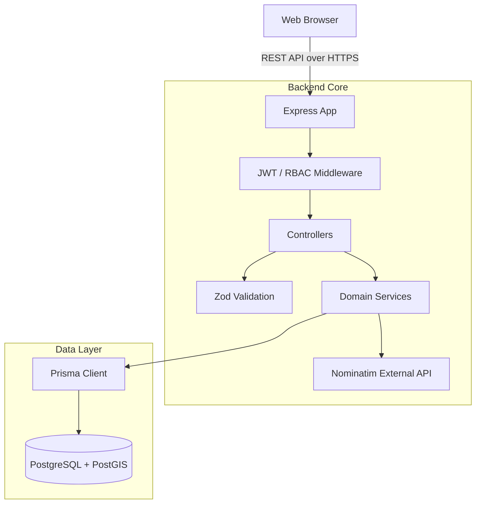
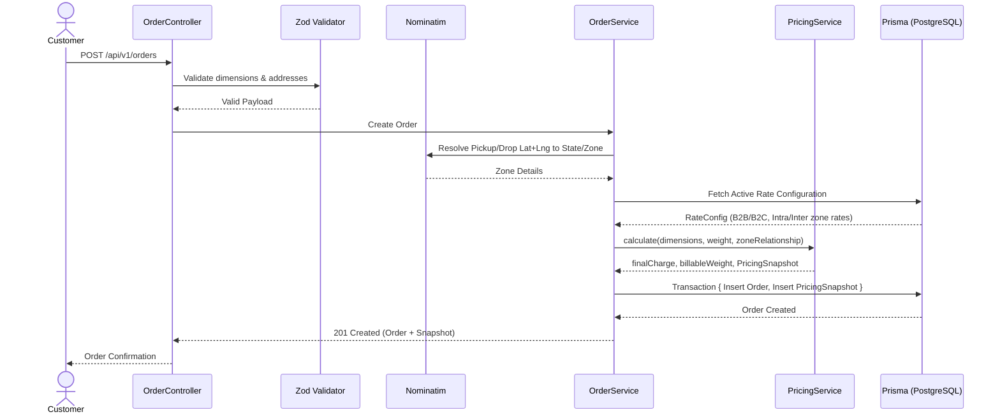
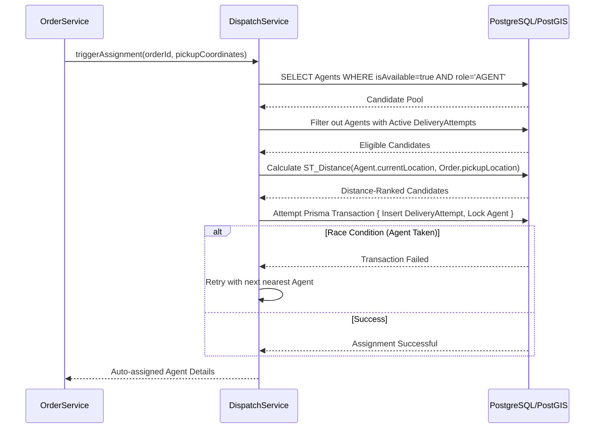

# Architecture Documentation

This document outlines the high-level architecture, component interactions, and complex domain flows (Pricing and Dispatch) for the Last Mile Delivery Tracker.

## 1. System Overview

The platform uses a decoupled frontend-backend architecture. 

- **Frontend:** A React 19 single-page application built with Vite, relying on React Router for client-side navigation and Zustand for lightweight global state (like active user sessions). 
- **Backend:** A Node.js Express 5 API that serves JSON payloads, protected by JWT authentication and strict Role-Based Access Control (RBAC) middleware.
- **Database:** PostgreSQL 16 enhanced with PostGIS for geospatial indexing and distance calculation. Interactions with the database are abstracted via Prisma ORM 5.19.

## 2. Component Architecture

## 3. Order Creation & Pricing Flow

The Pricing Engine is responsible for generating accurate quotes and persisting immutable Pricing Snapshots.

### Pricing Sequence Diagram

## 4. Intelligent Dispatch Flow

The Dispatch Engine identifies the most appropriate active agent by utilizing PostGIS native spatial functions.

### Dispatch Sequence Diagram

## 5. Delivery Lifecycle & Tracking Flow

Orders move through a strict, deterministic state machine (`PENDING` -> `ASSIGNED` -> `PICKED_UP` -> `IN_TRANSIT` -> `OUT_FOR_DELIVERY` -> `DELIVERED`).

- **Validation:** An agent cannot transition an order to `DELIVERED` if it is currently `ASSIGNED` (must progress logically).
- **Ledger:** Every state mutation requires an accompanying insertion into the `TrackingHistory` table. This creates an immutable, append-only ledger for customer transparency.

## 6. Authentication & RBAC Flow

1. **Authentication:** The `/auth/login` endpoint validates credentials and returns an HTTP payload containing a signed JWT (JSON Web Token).
2. **Identification:** The `authenticateToken` middleware intercepts requests, validates the JWT signature, and attaches the `userId` and `role` to the Express Request object.
3. **Authorization:** The `authorizeRole(['ADMIN'])` middleware checks the attached role. If a `CUSTOMER` attempts to hit an `ADMIN` endpoint, the request is immediately rejected with a `403 Forbidden` error before reaching the controller.

## 7. Testing Architecture

The backend implements a dedicated testing framework utilizing **Jest**.

- **Isolation:** A safety guard in `src/__tests__/setup.ts` strictly prevents tests from executing unless `DATABASE_URL_TEST` is present and explicitly contains the word "test".
- **Wiping:** `reset-test-db.ts` aggressively cleans all tables before test suites run.
- **Focus:** Tests primarily cover integration flows (e.g. testing the dispatch algorithm end-to-end through the REST API, down into PostGIS, and asserting the closest agent won the assignment).
